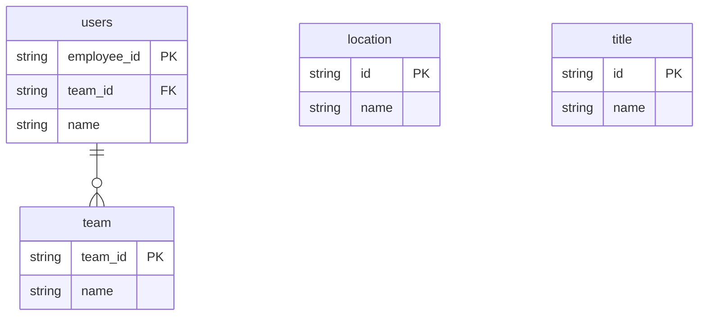

```mermaid
erDiagram
    users ||--o{team : ""

    users{
        string employee_id PK
        string team_id FK
        string name
    }

    location{
        string id PK
        string name
    }

    team{
        string team_id PK
        string name
    }

    title{
        string id PK
        string name
    }
```